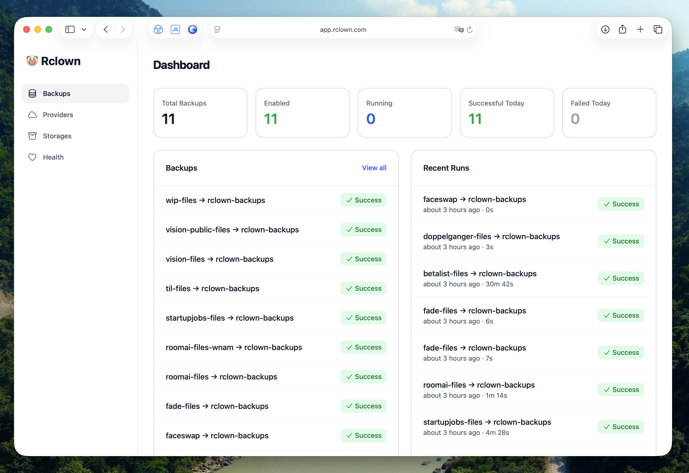

# Rclown 🤡

A friendly web UI for backing up your object storage buckets by [Marc Köhlbrugge](https://x.com/marckohlbrugge).

Rclown wraps the battle-tested [rclone](https://rclone.org/) in a simple interface. Schedule backups, see what's happening, get notified when something breaks. Supports Cloudflare R2, Backblaze B2, Amazon S3, and other S3-compatible providers.



## Features

- **Multi-provider support**: Cloudflare R2, Backblaze B2, Amazon S3
- **Bucket discovery**: Automatically find and import buckets from your providers
- **Scheduled backups**: Daily or weekly, with dry-run support
- **Flexible paths**: Back up entire buckets or specific sub-paths
- **Retention policies**: Deleted files kept for configurable period before cleanup
- **Comparison modes**: Size-only, checksum, or default (size + mtime) comparison
- **Live logs**: Stream backup progress in real-time
- **Failure notifications**: Email alerts when backups fail
- **System health**: Monitor CPU, memory, disk usage, and queue status

## Deployment

Rclown is designed for self-hosting. The Docker images include everything you need (Ruby, SQLite, rclone).

### Docker

The easiest way to self-host Rclown is with our pre-built Docker images. See [Docker Deployment](docs/docker-deployment.md) for details.

```sh
docker run -v rclown:/rails/storage \
  -e SECRET_KEY_BASE=$(openssl rand -hex 64) \
  -e HTTP_AUTH_USERNAME=admin \
  -e HTTP_AUTH_PASSWORD=your-password \
  -p 80:80 \
  ghcr.io/marckohlbrugge/rclown:main
```

### Kamal

For deploying your own fork with customizations, see [Kamal Deployment](docs/kamal-deployment.md).

### Dokku

For Dokku-based hosting, see [Dokku Deployment](docs/dokku-deployment.md).

## Development

```bash
git clone https://github.com/marckohlbrugge/rclown.git
cd rclown
bundle install
bin/rails db:setup
bin/dev
```

## Contributing

Bug fixes and small improvements are welcome as pull requests. For larger changes or new features, please open an issue first to discuss the approach.

## License

Rclown is released under the [O'Saasy License](https://osaasy.dev/). See [LICENSE.md](LICENSE.md) for details.
